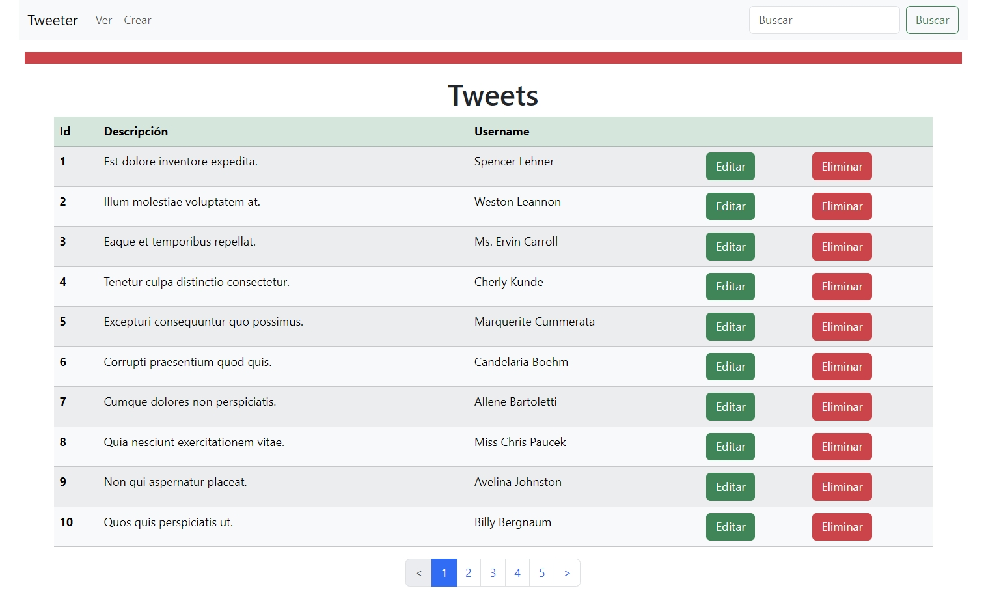

  

# Módulo 5 - Desafío 5
# Grupo: Fernando Lopes, José Eyzaguirre y Carlos Santana

Ruby on Rails - postgresql

## Descripción

Esta aplicación realiza el proceso de creación, edición, lectura y eliminación de tweets.

## Inicio

Estas instrucciones te ayudarán a obtener una copia del proyecto y a ejecutarlo en tu máquina local para fines de desarrollo y prueba.

### Pre-requisitos

Este proyecto fue desarrollado con Rails - versión 7 y PostgreSQL - versión 16.

### Instalación

Sigue estos pasos para ejecutar el proyecto localmente:

1. Clona este repositorio en tu máquina local.  
git clone https://github.com/crsantanag/m5d5.git

2. Navega hasta el directorio del proyecto.  
cd m5d5

3. Instala dependencias y modifica archivo database.yml  
   Las gemas que se deben instalar son:  
   - Faker  
   - Pagy  
   - Pg_search
   
4. Crea la base de datos, realiza la migración y carga los datos de prueba (ejecutar archivo seed.rb)

## Ejecutando las pruebas

Este proyecto no cuenta con pruebas automatizadas. Sin embargo, puedes probar manualmente todas las funcionalidades.

## Licencia

Este proyecto está bajo la Licencia MIT. Consulta el archivo [LICENSE.md](LICENSE.md) para obtener más detalles.

⌨ ️Fernando Lopes, José Eyzaguirre y Carlos Santana (https://github.com/crsantanag)
